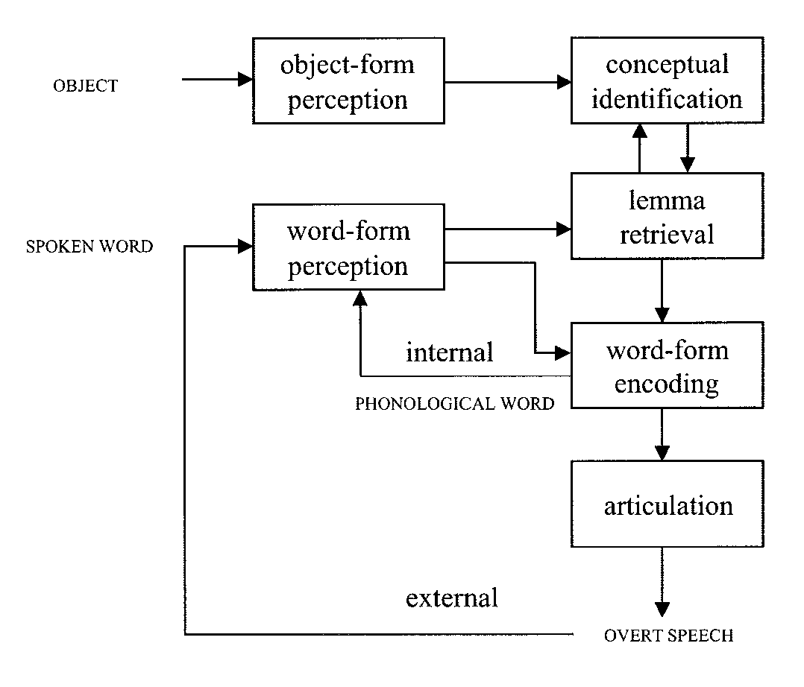

# CCAP プロジェクト

- CCAP とは何か？

CCAP is the abbrivatation of Computational Clinical Aphasia Project:

CCAP は計算論的臨床失語症プロジェクトの意味です。CCAP の名付け親は橋本先生

Project CCAP ではプロジェクトが重なっていますが，命名権を取得できなかったので，止む無くこのような形にしました。
ご了承ください。

## 2021_10

- [tiny celeba dataset](data/tiny_celeba.tgz)
- [JNPS プレゼンテーションビデオ](2021jnps_presentation.mp4)

## 2021_09

- [Bates et al (2003) ボクセルに基づく病変・症状マッピング](https://project-ccap.github.io/2003Bates_Dronkers_Voxel-based_lesi-symptom_mapping.pdf){:target="_blank"}
- [Catani and Mesalum (2008) 言語と失語症における弓状束と離断のテーマ：歴史と現在の状況](https://project-ccap.github.io/2008Catani_Mesulam_arcuate_fasciculus_and_the_disconnection_theme_in_language_and_aphasia_History_and_current_state.pdf){:target="_blank"}
- [McClelland (2014) 知覚と認知における相互活性化と相互制約充足](https://project-ccap.github.io/2014McClelland_Interactive_Activation_and_Mutual_Constraint_Satisfaction_in_Perception_and_Cognition.pdf){:target="_blank"}
- [Goldrick (2016) SLAM と既存の証拠との統合: Walker and Hickok (2015) へのコメント](https://project-ccap.github.io/2016Goldrick_Integrating_SLAM_with_existing_evidence_Comment_on_Walker_and_Hickok2015.pdf){:target="_blank"}
- [Walker and Hickok (2015) 音声生成への計算機的アプローチの架け橋: 意味・語彙・聴覚・発話・運動モデル (SLAM)](https://project-ccap.github.io/2016Walker-Hickok_Bridging_computational_approaches_to_speech_production_The_semantic–lexical–auditory–motor_model-SLAM.pdf){:target="_blank"}
- [wrod2vec による TLPA, SALA 図版の意味ベクトル ](https://project-ccap.github.io/2021_0905ccap_tlpa_word2vec.xlsx){:target="_blank"}
- [ResNet18 による各検査図版の視覚的特徴 ](https://project-ccap.github.io/2020-0713ccap_ResNet.xlsx){:target="_blank"}
ResNet18 に各検査図版を入力して，最終直下層の出力を得ました。ここで言う検査とは次の 4 検査です: TLPA, SALA, PNT, Snodgrass and Vanderwert. **各図版には著作権がついている可能性がありますが，各ベクトルのデータの著作権は浅川が保持しています**。 一枚の図版あたり 512 次元のベクトルです。 このベクトルを各検査図版ごとにエクセルファイルにしました。
- [BERT の超簡単な使い方 ](https://colab.research.google.com/github/komazawa-deep-learning/komazawa-deep-learning.github.io/blob/master/2021notebooks/2021_0903BERT_demo.ipynb){:target="_blank"}

## 2021_08

- [認知神経心理学研究会](2021cnps){:target="_blank"}

### 文献資料
- [名詞の意味に関連した人間の脳活動の予測, Mitchell, 2018, Predicting Human Brain Activity Associated with the Meanings of Nouns](https://shinasakawa.github.io/2008Mitchell_Predicting_Human_Brain_Activity_Associated_with_the_Meanings_of_Nounsscience.pdf){:target="_blank"}
- [失語症の命名課題における無回答エラーモデル, Dell et al.(2004) Models of errors of omission in aphasic naming](https://project-ccap.github.io/2004Dell_Models_of_errors_of_omission_in_aphasic_naming.pdf){:target="_blank"}
- [ゴール駆動型深層学習モデルを用いた感覚皮質の理解 Yamins(2016) Nature](https://project-ccap.github.io/2016YaminsDiCarlo_Using_goal-driven_deep_learning_models_to_understand_sensory_cortex.pdf){:target="_blank"}

## 2021_0728

### 文献資料
- [ディープラーニング概説, 2015, LeCun, Bengio, Hinton, Nature](https://komazawa-deep-learning.github.io/2021/2015LeCun_Bengio_Hinton_NatureDeepReview.pdf){:target="_blank"}
- [ディープラーニング回顧録 Senjowski, 2020, Unreasonable effectiveness of deep learning in artificial intelligence](https://komazawa-deep-learning.github.io/2021/2020Sejnowski_Unreasonable_effectiveness_of_deep_learning_in_artificial_intelligence.pdf){:target="_blank"}
- [ディープラーニングレビュー Storrs ら, 2019, Neural Network Models and Deep Learning, 2019](https://komazawa-deep-learning.github.io/2021/2019Storrs_Golan_Kriegeskorte_Neural_network_models_and_deep_learning.pdf){:target="_blank"}
- [深層学習と脳の情報処理レビュー Kriegestorte, 2015, Deep Neural Networks: A New Framework for Modeling Biological Vision and Brain Information Processing](2015Kriegeskorte_Deep_Neural_Networks-A_New_Framework_for_Modeling_Biological_Vision_and_Brain_Information_Processing.pdf){:target="_blank"}
- [計算論的認知神経科学 Kriegeskorte and Douglas, 2018, Cognitive computational neuroscience](2018Kriegeskorte_Douglas_Cognitive_Computational_Neuroscience.pdf){:target="_blank"}
- [視覚系の畳み込みニューラルネットワークモデル，過去現在未来 Lindsay, 2020, Convolutional Neural Networks as a Model of the Visual System: Past, Present, and Future](2020Lindsay_Convolutional_Neural_Networks_as_a_Model_of_the_Visual_System_Past_Present_and_Future.pdf){:target="_blank"}
- [注意レビュー論文 Lindsay, 2020, Attention in Psychology, Neuroscience, and Machine Learning](2020Lindsay_Attention_in_Psychology_Neuroscience_and_Machine_Learning.pdf){:target="_blank"}
- [運動制御のカルマンフィルター仮説 Wolpert, Ghahramani, and Jordan, 1995, An Internal Model for Sensorimotor Integration](1995WolpertGhahramaniJordan_Internal_Model_for_Sensorimotor_Integration.pdf){:target="_blank"}
- [ハブ＆スポーク仮説 Lambon Ralph, M., Jefferies, E., Patterson, K, and Rogers, T.T., 2017 The neural and computational bases of semantic cognition](2017LambonRalphJefferiesPattersonRogers_The_neural_and_computational_bases_of_semantic_cognition.pdf){:target="_blank"}

## 2021_0722

	 
	Roelofs (2004) Fig. 2 

- [2021_0705 リカレントニューラルネットワーク 概説 (再)](2016RNNcamp2handout.pdf){:target="_blank"}
- [日本語wikipedia による word2vec Colab 版 2021年5月 neologd 追加](https://colab.research.google.com/github/project-ccap/project-ccap.github.io/blob/master/notebooks/2021_0531ccap_word2vec.ipynb){:target="_blank"}

## WEAVER++, Dell モデルの再現シミュレーション colab files 
- [2021年02月22日実施 Dell モデル (Dell, 1997; Foygell and Dell,2000) 再現実験 ](https://colab.research.google.com/github/project-ccap/project-ccap.github.io/blob/master/notebooks/2021Foygel_Dell_model.ipynb)
- [2021ccap word2vec による単語連想課題のデモ, Rotaru(2018) に関連 ](https://colab.research.google.com/github/project-ccap/project-ccap.github.io/blob/master/notebooks/2021ccap_word_association_demo.ipynb)
  -  [word2vec による単語連想 + 頻度 デモ ](https://colab.research.google.com/github/project-ccap/project-ccap.github.io/blob/master/notebooks/2021ccap_word_assoc_with_freq.ipynb)

- [他言語プライミング課題での事象関連電位 （ERP) のシミュレーション Roelofs, Cortex (2016) ](https://colab.research.google.com/github/project-ccap/project-ccap.github.io/blob/master/notebooks/2021Roelofs_ERP_bilingual_lemret.ipynb)
- [概念バイアス `Conceptual Bias` (Reolofs, 2016) 絵画命名，単語音読，ブロック化，マルチモーダル統合 ](https://colab.research.google.com/github/project-ccap/project-ccap.github.io/blob/master/notebooks/2021Roelofs_Conceptual_bias.ipynb)
- [2 ステップ相互活性化モデルデモ (Foygell and Dell, 2000) ](https://colab.research.google.com/github/project-ccap/project-ccap.github.io/blob/master/notebooks/2020ccap_Foygel_Dell2000_2step_interactive_activaition_model_demo.ipynb)
- [WEVER++ デモ 2020-1205 更新 Reolofs(2019) Anomia cueing ](https://colab.research.google.com/github/project-ccap/project-ccap.github.io/blob/master/notebooks/2020ccap_Roelofs2019_Anomia_cueing_demo.ipynb)
	- [上の簡単なまとめ](2020-1214about_Roelofs_anomia_cueing)

## その他情報
- [2020-0819 st2vec の tSNE](2020-0819st2vec_tsne/2020-0819st2vec_tsne.html)
- [2020-0720PNT+Snodgrass の結果](2020-0720pnt_snodgrass_resnet18.pdf)
- [2020-0604word2vec から見た TLPA 名詞200語のプロットtSNE_バージョン](figures/tlpa_tSNE.pdf)
- [2020-0323ccap_handouts.pdf](2020-0323ccap_handouts.pdf)
- [2020-0201bibliography.pdf](2020-0201bibliography.pdf)
- [2020-0128cnps_handouts.pdf](2020-0128cnps_handouts.pdf)
- [2020computational_neuropsychology.pdf](2020computational_neuropsychology.pdf)

## 簡単なデモ プレイグラウンド
- [TensorFlow Playgournd ニューラルネットワークの基本](https://project-ccap.github.io/tensorflow-playground)
- [リカレントニューラルネットワークによる文字ベース言語モデル Javascript](https://komazawa-deep-learning.github.io/character_demo.html)
- [効果的な t-SNE 使用方法](https://project-ccap.github.io/misread-tsne/index.html)

## 2019CNPS 資料より

- [Colab についての蘊蓄](https://jpa-bert.github.io/supp01_colab)
- [Colab による外部ファイルとのインタフェース](https://jpa-bert.github.io/supp02_colab_file_management)
- [Python と numpy の初歩](https://jpa-bert.github.io/python_numpy_intro_ja)
- [CNN についての蘊蓄](https://jpa-bert.github.io/supp05_cnn)
- [RNN についての蘊蓄](https://jpa-bert.github.io/supp06_rnn)
- [NLP についての蘊蓄](https://jpa-bert.github.io/supp07_nlp)

